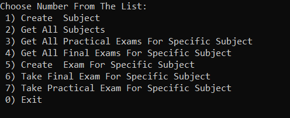
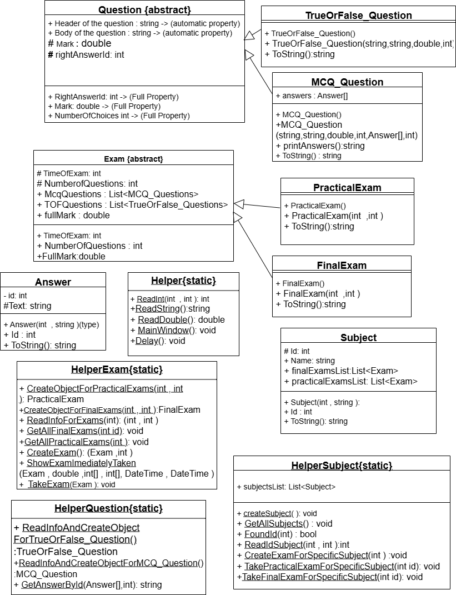

# Examination_System
# Main View:

# 📘 Project Overview

This project is an Examination System designed to manage subjects, exams, questions, and answers. It demonstrates Object-Oriented Programming (OOP) concepts such as inheritance, polymorphism, interfaces, constructor chaining, and overriding methods.

The system supports two types of exams:
Final Exam – Includes True/False and MCQ questions.
Practical Exam – Includes True/False and MCQ questions.

# 🏗️ System Features

1. Question Management
  * Base Question class to represent:
    * Header (title of question)
    * Body (question text)
    * Mark (score of the question)
  * Supports multiple question types:
    * True/False (for Final Exam)  
    * MCQ – Multiple Choice Questions (for both exams)
2. Answer Management
  * Each question is linked with multiple possible answers.
  * Stores:
    * AnswerId (unique identifier)
    * AnswerText (answer content)
  * Each question has one right answer.
3. Exam Management
  * Base Exam class contains:
     * Exam duration (time limit)
     * Number of questions
     * Show Exam functionality (different for each exam type)
  * Practical Exam:
    * Displays the correct answers after the student finishes.
  * Final Exam:
    * Displays all questions, available answers, and the student’s final grade.
4. Subject Management
  * Each subject has:
   * SubjectId
   * SubjectName
   * Associated Exam
  * Provides functionality to create and assign exams to subjects.

# CLass Diagram :

